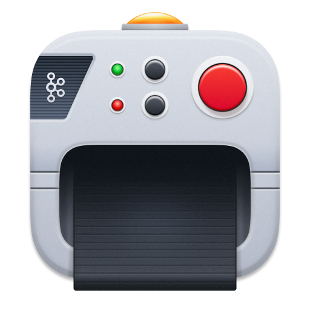
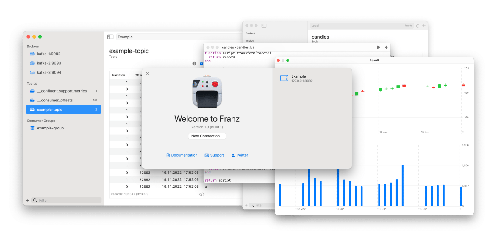

# Franz

  

Franz is a native macOS desktop client for Apache Kafka. It is **not**
Open Source. I'm providing the source code here because I want users to
be able to see the code they're running and even change and build it for
themselves if they want to. You are free to read the code, and to build
and run the application yourself, on your own devices, but please don't
share any built artifacts with others. If you find Franz useful, please
consider [purchasing a license].

[purchasing a license]: https://franz.defn.io

## Build

### Requirements

* [Racket 8.9 CS](https://racket-lang.org/)
* macOS 12.3+
* Xcode 12+

### First-time Setup

1. Set up [Noise](https://github.com/Bogdanp/Noise).
1. `raco pkg install --name franz core/`

### Building

    $ make

## License

    Copyright 2022-2024 CLEARTYPE SRL.  All rights reserved.
